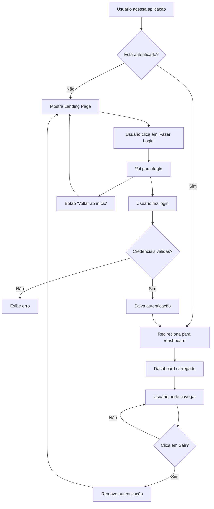

# 🔐 Sistema de Autenticação e Rotas

## 📋 Visão Geral

O sistema agora possui autenticação completa com página inicia### 2. Login (`/src/components/login.tsx`)
- Formulário completo de login
- Validação de campos
- Estados de loading e erro
- Design responsivo
- Credenciais de demo visíveis
- Botão "Voltar ao início" para landing page

### 3. Dashboard (`/src/components/Dashboard.tsx`)ativa, login, proteção de rotas e navegação entre páginas.

## 🛣️ Rotas Disponíveis

### Rotas Públicas
- **`/`** - Página inicial (Landing Page) com explicação do projeto
- **`/login`** - Página de login
  - Redireciona para `/dashboard` se já estiver autenticado

### Rotas Protegidas (requer login)
- **`/dashboard`** - Dashboard principal com lista de sessões
- **`/qr`** - Página dedicada para visualizar QR codes

### Redirecionamentos
- **Usuário não autenticado**: 
  - Qualquer rota protegida → `/login`
  - Rota não encontrada → `/`
- **Usuário autenticado**: 
  - `/login` ou `/` → `/dashboard`
  - Rota não encontrada → `/dashboard`

## 🏠 Nova Página Inicial (Landing Page)

### Características
- **Design moderno**: Layout responsivo com gradientes e animações
- **Explicação completa**: Apresenta todas as funcionalidades do projeto
- **Call-to-action**: Botões estratégicos para direcionamento ao login
- **Tecnologias**: Seção mostrando stack tecnológico utilizado
- **Benefícios**: Lista de vantagens do sistema

### Seções da Landing Page
1. **Header**: Logo + botão de login fixo
2. **Hero**: Título principal + descrição + CTA
3. **Funcionalidades**: Grid com 6 recursos principais
4. **Benefícios**: Lista de vantagens + card promocional
5. **Tecnologias**: Grid com stack tecnológico
6. **CTA Final**: Seção de conversão
7. **Footer**: Informações finais

## 🔑 Credenciais de Acesso

### Demo
- **Usuário**: `admin`
- **Senha**: `admin123`

## 🚀 Como Usar

### 1. Acesso Inicial
1. Acesse `http://localhost:5173`
2. Visualize a página inicial explicativa
3. Clique em "Fazer Login" ou "Acessar Dashboard"
4. Digite as credenciais de demo
5. Clique em "Fazer Login"

### 2. Navegação na Landing Page
- **Header**: Botão de login sempre visível
- **Hero Section**: CTA principal para acesso
- **Funcionalidades**: Entenda os recursos disponíveis
- **Benefícios**: Conheça as vantagens do sistema
- **Tecnologias**: Veja o stack tecnológico
- **Footer**: Informações adicionais

### 3. Dashboard
- Após login, será redirecionado para `/dashboard`
- Visualize todas as sessões WhatsApp
- Crie novas sessões
- Acesse QR codes
- Gerencie sessões existentes

### 3. QR Codes
- No header, clique em "QR Codes" para ir para `/qr`
- Ou clique em "Ver QR Code" em qualquer sessão
- Selecione a sessão desejada
- Visualize e baixe o QR code

### 4. Logout
- No dashboard, clique em "Sair" no canto superior direito
- Confirme a ação
- Sistema redirecionará para `/login`

## 🔒 Segurança e Autenticação

### Funcionamento
```typescript
// Verificação de autenticação
const isAuthenticated = localStorage.getItem('isAuthenticated') === 'true';

// Dados do usuário
const userData = JSON.parse(localStorage.getItem('user') || '{}');
```

### Proteção de Rotas
```typescript
// ProtectedRoute component
function ProtectedRoute({ children }) {
  const isAuthenticated = localStorage.getItem('isAuthenticated') === 'true';
  
  if (!isAuthenticated) {
    return <Navigate to="/login" replace />;
  }
  
  return children;
}
```

### Persistência de Sessão
- **localStorage**: Mantém autenticação entre sessões do navegador
- **Logout**: Remove dados de autenticação
- **Redirect automático**: Baseado no status de autenticação

## 🎨 Componentes Criados

### 1. Landing Page (`/src/components/Landing.tsx`)
- Página inicial explicativa do projeto
- Design moderno com seções bem estruturadas
- Call-to-actions estratégicos
- Totalmente responsiva
- Apresentação completa das funcionalidades

### 2. Login (`/src/components/login.tsx`)
- Formulário completo de login
- Validação de campos
- Estados de loading e erro
- Design responsivo
- Credenciais de demo visíveis

### 2. Dashboard (`/src/components/Dashboard.tsx`)
- Versão protegida do Home
- Barra de usuário com logout
- Todas as funcionalidades do gerenciador de sessões

### 3. ProtectedRoute (`/src/components/ProtectedRoute.tsx`)
- HOC para proteger rotas
- Redirecionamento automático
- Verificação de autenticação

### 4. QRPage (`/src/components/QRPage.tsx`)
- Página dedicada para QR codes
- Navegação de volta ao dashboard

## 🔧 Configuração de Rotas

### Router Principal (`App.tsx`)
```typescript
<Router>
  <Routes>
    {/* Rota pública */}
    <Route path="/login" element={...} />
    
    {/* Rotas protegidas */}
    <Route path="/dashboard" element={
      <ProtectedRoute>
        <Dashboard />
      </ProtectedRoute>
    } />
    
    <Route path="/qr" element={
      <ProtectedRoute>
        <QRPage />
      </ProtectedRoute>
    } />
    
    {/* Redirecionamentos */}
    <Route path="/" element={<Navigate to={...} />} />
    <Route path="*" element={<Navigate to={...} />} />
  </Routes>
</Router>
```

## 🎯 Navegação

### Header Atualizado
- **QR Codes**: Botão para navegar para `/qr`
- **Atualizar**: Refresh dos dados
- **Nova Sessão**: Modal de criação

### Dashboard
- **Sair**: Logout e redirecionamento
- **Bem-vindo**: Exibe nome do usuário logado

### 6. Button Component (`/src/components/ui/Button.tsx`)
- Componente reutilizável de botão
- Variantes: primary, secondary, outline
- Tamanhos: sm, md, lg
- Estados de disabled e loading
- Totalmente tipado com TypeScript

## 🔄 Fluxo de Navegação Atualizado



## 🛡️ Melhorias de Segurança

### Para Produção
1. **JWT Tokens**: Substitua localStorage por tokens JWT
2. **Refresh Tokens**: Implementar renovação automática
3. **HTTPS**: Sempre usar conexões seguras
4. **Validação Backend**: Validar tokens no servidor
5. **Rate Limiting**: Limitar tentativas de login
6. **2FA**: Implementar autenticação de dois fatores

### Exemplo de Implementação JWT
```typescript
// services/auth.ts
export const authAPI = {
  async login(credentials) {
    const response = await api.post('/auth/login', credentials);
    const { token, refreshToken } = response.data;
    
    localStorage.setItem('token', token);
    localStorage.setItem('refreshToken', refreshToken);
    
    return response.data;
  },
  
  async refreshToken() {
    const refreshToken = localStorage.getItem('refreshToken');
    const response = await api.post('/auth/refresh', { refreshToken });
    
    localStorage.setItem('token', response.data.token);
    return response.data;
  }
};
```

## 📱 Responsividade

### Design Mobile-First
- ✅ Login responsivo em todas as telas
- ✅ Dashboard adaptável
- ✅ Navegação mobile-friendly
- ✅ Modals responsivos

### Breakpoints
- **Mobile**: < 640px
- **Tablet**: 640px - 1024px
- **Desktop**: > 1024px

## 🎨 Personalizações

### Credenciais Customizadas
Para alterar as credenciais de demo, edite em `login.tsx`:
```typescript
if (formData.username === 'seu_usuario' && formData.password === 'sua_senha') {
  // Login válido
}
```

### Integração com API Real
Substitua a simulação por uma chamada real:
```typescript
// Substitua esta parte em login.tsx
try {
  const response = await authAPI.login(formData);
  localStorage.setItem('isAuthenticated', 'true');
  localStorage.setItem('user', JSON.stringify(response.user));
  navigate('/dashboard');
} catch (error) {
  setError('Credenciais inválidas');
}
```

## 🚨 Estados de Error

### Tratamento de Erros
- ✅ Credenciais inválidas
- ✅ Campos obrigatórios
- ✅ Erro de conexão
- ✅ Sessão expirada

### Mensagens Amigáveis
- Feedback visual imediato
- Instruções claras de correção
- Estados de loading bem definidos

---

**🎉 Sistema completo implementado com sucesso!**

O frontend agora possui:
- ✅ **Landing Page explicativa** com design moderno
- ✅ **Sistema de login** com validação completa
- ✅ **Proteção de rotas** com redirecionamentos inteligentes
- ✅ **Dashboard funcional** para gerenciamento de sessões
- ✅ **Navegação fluida** entre todas as páginas
- ✅ **Design responsivo** para todos os dispositivos
- ✅ **Componentes reutilizáveis** para manutenibilidade

A aplicação está pronta para uso e pode ser facilmente customizada para suas necessidades específicas!
