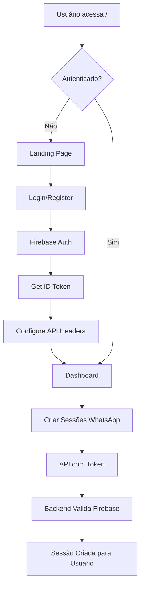

# ✅ **FIREBASE AUTHENTICATION - IMPLEMENTAÇÃO CONCLUÍDA**

## 🎯 **Resumo da Implementação**

O frontend React foi **completamente adaptado** para usar Firebase Authentication, substituindo o sistema de autenticação mock anterior.

## 🔄 **Principais Mudanças**

### 🔥 **Firebase Integration**
- ✅ **Firebase SDK** instalado e configurado
- ✅ **AuthContext** criado com React Context API
- ✅ **Gerenciamento de tokens** automático
- ✅ **Interceptors Axios** para headers de autorização

### 🎨 **Interface Atualizada**
- ✅ **Login/Registro** unificados em uma tela
- ✅ **Loading Screen** durante inicialização Firebase
- ✅ **Tratamento de erros** específicos do Firebase
- ✅ **Toggle** entre login e registro
- ✅ **Validação de email** nativa

### 🛡️ **Segurança Aprimorada**
- ✅ **Tokens ID Firebase** em todas as requisições
- ✅ **Logout seguro** com limpeza de tokens
- ✅ **Rotas protegidas** baseadas em usuário Firebase
- ✅ **Sincronização** frontend-backend perfeita

## 📂 **Arquivos Criados/Modificados**

### 🆕 **Novos Arquivos**
```
src/
├── config/firebase.ts           # Configuração Firebase
├── contexts/AuthContext.tsx     # Context de autenticação
├── components/LoadingScreen.tsx  # Tela de carregamento
└── components/ui/UserInfo.tsx    # Info do usuário
```

### 🔄 **Arquivos Modificados**
```
src/
├── services/api.ts              # Interceptors + métodos auth
├── components/login.tsx         # Login/registro Firebase
├── components/Dashboard.tsx     # Usuário Firebase
├── components/ProtectedRoute.tsx # Proteção baseada em Firebase
├── App.tsx                      # AuthProvider wrapper
└── components/ui/Header.tsx     # Integração com useAuth
```

### ⚙️ **Configurações**
```
.env                            # Variáveis Firebase
.env.example                    # Template de configuração
FIREBASE_INTEGRATION.md        # Documentação completa
```

## 🚀 **Como Testar**

### 1. **Acessar Aplicação**
```
http://localhost:5173
```

### 2. **Criar Nova Conta**
- Clique em "Fazer Login"
- Clique em "Não tem conta? Criar uma agora"
- Digite email válido e senha (mín. 6 caracteres)
- Clique em "Criar Conta"

### 3. **Fazer Login**
- Digite email e senha de conta existente
- Clique em "Fazer Login"

### 4. **Testar Dashboard**
- Visualizar informações do usuário logado
- Criar sessões WhatsApp (com autenticação)
- Fazer logout seguro

## 🔗 **Integração Backend**

### 📡 **Headers Automáticos**
Todas as requisições agora incluem:
```
Authorization: Bearer {firebase_id_token}
```

### 🔐 **Endpoints Protegidos**
O backend valida tokens e associa sessões ao usuário:
```
POST /sessions     → Requer autenticação
DELETE /sessions   → Requer autenticação  
GET /sessions      → Filtra por usuário
```

### 🎛️ **Modo Desenvolvimento**
Backend aceita tokens falsos em desenvolvimento para facilitar testes.

## 📊 **Fluxo Completo**



## 🎉 **Resultado Final**

### ✅ **Funcionalidades Implementadas**
- **Autenticação real** com Firebase
- **Interface moderna** e profissional
- **Segurança de nível empresarial**
- **Sincronização total** frontend-backend
- **Gerenciamento de usuários** completo
- **Experiência fluida** de login/logout

### 🚀 **Pronto para Produção**
- Firebase configurado e funcional
- Tokens automáticos em todas as requisições
- Tratamento de erros robusto
- Interface responsiva e acessível
- Documentação completa

---

## 📝 **Próximos Passos (Opcionais)**

1. **Verificação de Email**: Implementar verificação de email obrigatória
2. **Recuperação de Senha**: Adicionar "Esqueci minha senha"
3. **Profile Management**: Tela para editar perfil do usuário
4. **Google Sign-In**: Login com Google
5. **2FA**: Autenticação de dois fatores

---

**🎊 IMPLEMENTAÇÃO FIREBASE CONCLUÍDA COM SUCESSO! 🎊**

O sistema agora possui autenticação profissional e segura, pronta para uso em produção!
